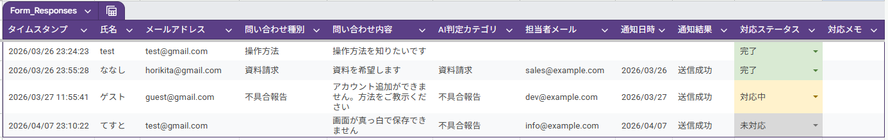
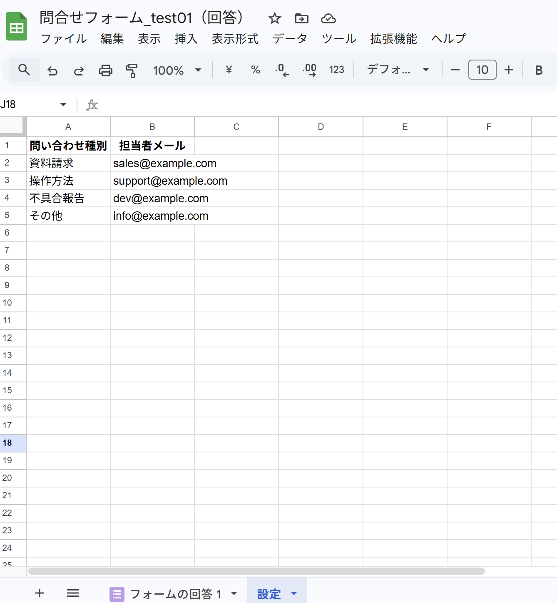
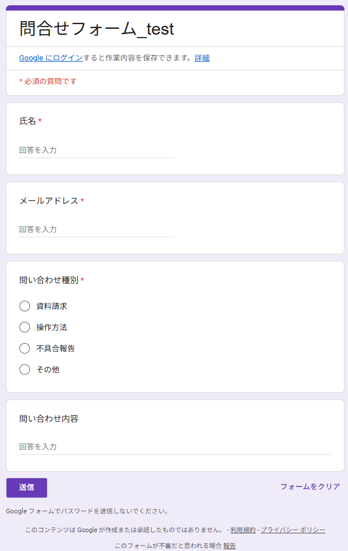
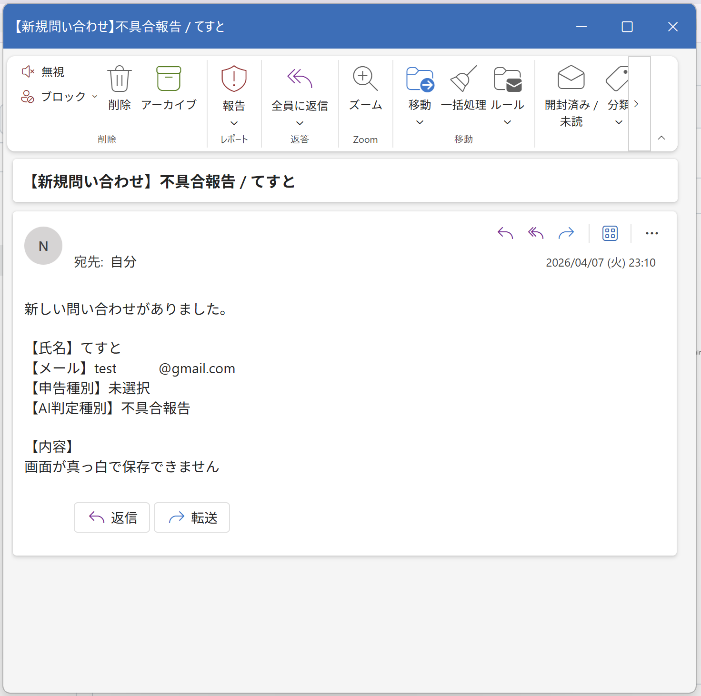

## Description
A Google Apps Script-based inquiry routing tool that automatically classifies form submissions and notifies the appropriate person in charge. It now supports AI-based classification of free-text inquiries using Azure OpenAI API, along with status tracking in Google Sheets.

## 概要
Googleフォームから受け付けた問い合わせを自動で振り分け、担当者へ通知する業務効率化ツールです。  
担当者情報をスプレッドシートで管理することで、コード修正なしで運用可能な設計としています。
従来のカテゴリ選択による振り分けに加え、Azure OpenAI API を利用した自由記述の自動分類に対応し、担当者への通知と対応ステータス管理を効率化しました。

## 背景
問い合わせ受付後の担当者振り分けや通知を手作業で行う場合、対応漏れや確認工数が発生しやすいという課題があります。  
本ツールでは、それらの業務を自動化し、対応スピードと正確性の向上を目的として作成しました。

## 実装内容
- Googleフォーム回答の取得
- 問い合わせ本文のAI分類（Azure OpenAI API）
- 分類結果に応じた担当者振り分け
- Gmailによる自動通知
- スプレッドシートへの処理結果記録（AI判定結果・担当者・通知日時・通知ステータス・対応ステータス・対応メモ）

## 実行画面（スクリーンショット）
### スプレッドシート（フォーム回答・設定シート）
| フォーム回答 | 設定 |
|-------------|------|
|  |  |

### 入力フォーム・通知メール
| フォーム画面 | 通知メール |
|-------------|-----------|
|  |  |

## 使用技術
- Google Forms
- Google Sheets
- Google Apps Script（GAS）
- GmailApp
- Azure OpenAI API

## 処理フロー
フォーム送信
↓
スプレッドシートに回答記録
↓
GASで申告種別・自由記述を取得
↓
自由記述がある場合は Azure OpenAI API で分類
↓
分類結果に応じて担当者を判定（設定シート参照）
↓
担当者へメール通知
↓
処理結果をシートへ記録  

## 工夫した点
- 担当者情報をコードではなくスプレッドシートで管理し、運用時の保守性を向上
- トリガー（onFormSubmit）を使用し、リアルタイムで処理を実行
- 通知ステータスを記録し、エラー時の追跡が可能な設計
- 問い合わせ本文を Azure OpenAI API で分類し、自由記述ベースの自動振り分けに対応
- APIキーをコードに直書きせず、Apps Script のスクリプトプロパティで管理

## 今後の改善案
- [ ] キーワード判定による自動分類の高度化
- [ ] Slack等の外部ツールとの通知連携
- [x] ステータス管理機能（対応中・完了など）の追加
- [x] Azure AIとの連携による自動分類精度向上
- [x] 初期設定用スクリプトによるヘッダー・プルダウン・条件付き書式の自動設定
